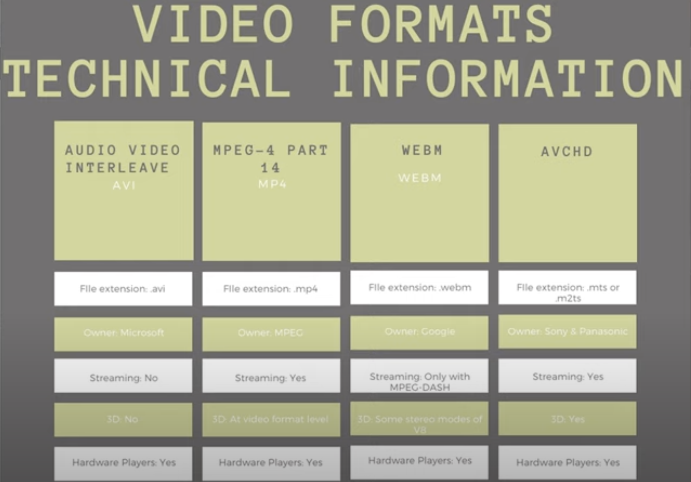

1. hls and dash does not have much difference apart being
   - dash does not runs on ios supported players like players of safari
2. hls is m3u8 based where as dash is xml based
3. hls also supported fmp4
4. command to convert an mp4 file to dash with manifest with mpd extension

```
ffmpeg -i input.mp4 -map 0 -map 0 -c:a aac -c:v libx264 -b:v:0 800k -b:v:1 300k -var_stream_map "v:0,name:800k v:1,name:300k" -f dash -dash_segment_type mp4 -single_file 1 classroom_manifest.mpd
```

5. command to convert an mp4 file to hls with manifest with m3u8 extension

```
ffmpeg -i input.mp4 -map 0 -map 0 -c:a aac -b:v:0 800k -b:v:1 300k -var_stream_map "v:0,name:800k v:1,name:300k" -master_pl_name classroom_manifest.m3u8 -f hls -hls_flags single_file -hls_playlist_type vod -hls_segment_filename "classroom_%v/classroom.ts" classroom_%v/index.m3u8
```

```
ffmpeg -re -i ~/Downloads/SampleVideo_1280x720_1mb.mp4 -map 0 -map 0 -c:a aac -c:v libx264 -b:v:0 800k -b:v:1 300k -s:v:1 320x170 -profile:v:1 baseline -profile:v:0 main -bf 1 -keyint_min 120 -g 120 -sc_threshold 0 -b_strategy 0 -ar:a:1 22050 -use_timeline 1 -use_template 1 -window_size 5 -adaptation_sets "id=0,streams=v id=1,streams=a" -f dash output_manifest.mpd
```

# ffmpeg

1. trim specific part of the video

```
ffmpeg -i input.mp4 -ss 10 -t 20 output.mp4
```

here

- -i is input,
- -ss is the seek duration in seconds, which says seek to 10th second of the video
- -t is the total duration till the video should be trimmed to, this is also in seconds

the output of this will create a 20 second video which is from 10th second of the original video to 30th second of the original video

```
ffmpeg -i input.mp4 -ss 00:00:10 -to 00:00:30 output.mp4
```

here

- -to is the end time

this command behaves exactly similar to the previous command

NOTE - if the time duration provided is only 00:10 then it will be mm:ss

2. trim and convert to different video format

```
ffmpeg -i input.mov -ss 00:00:10 -to 00:00:15 -c:v libx264 output.mp4
```

### what is -c:v

```
-c:v option is used to specify the codec for the video stream. The -c stands for "codec," and :v specifies that this option applies to the video stream.

For example:

-c:v libx264 would specify that the video codec to be used is libx264, which is an H.264 encoder.
-c:v copy would instruct FFmpeg to copy the video stream from the input file without re-encoding it.
```

### what is libx264

```
this is a video codec which is an H.264 encoder
```

### what is the difference between mov and mp4

```
MOV and MP4 are both digital video formats used to store video and audio data, but they have distinct differences in terms of their development, compatibility, and use cases. Here are the key differences:

1. **Development and Origin**:
   - **MOV**: Developed by Apple, the MOV format is primarily associated with Apple's QuickTime framework. It was designed for QuickTime player and is used extensively in macOS and iOS environments.
   - **MP4**: Developed as part of the MPEG-4 standard by the International Organization for Standardization (ISO), the MP4 format is widely used across various platforms and devices. It's an international standard for digital video and audio coding.

2. **Compatibility**:
   - **MOV**: While highly compatible with Apple's ecosystem (macOS, iOS, and QuickTime Player), MOV files might face compatibility issues with non-Apple devices and software.
   - **MP4**: Known for its broad compatibility, MP4 files can be played on almost any device or media player, including Windows, Android, and various smart TVs and gaming consoles.

3. **File Size and Compression**:
   - **MOV**: Generally, MOV files are larger due to less efficient compression, which can result in higher quality but larger file sizes.
   - **MP4**: Utilizes more efficient compression techniques, resulting in smaller file sizes with minimal loss in quality. This makes MP4 files more suitable for streaming and sharing over the internet.

4. **Use Cases**:
   - **MOV**: Often used in professional video editing and production environments, especially on Apple devices. It supports a wide range of codecs and high-quality video editing features.
   - **MP4**: Commonly used for storing and sharing video content on the internet, social media platforms, and streaming services due to its smaller file size and wide compatibility.

5. **Container and Codec Support**:
   - **MOV**: As a flexible container format, MOV can hold a variety of multimedia elements (video, audio, text, and effects) and supports multiple codecs. This makes it versatile for different types of media and editing processes.
   - **MP4**: Also a versatile container, MP4 typically uses popular codecs like H.264 for video and AAC for audio, which are efficient and widely supported, contributing to its widespread use.

6. **Editing and Metadata**:
   - **MOV**: Provides extensive support for editing and adding metadata, making it a preferred choice for professional video editing and production.
   - **MP4**: While it also supports metadata, MP4 is more focused on end-user consumption and distribution, providing a balance between quality and file size.

In summary, MOV is often preferred for high-quality video editing and professional use within the Apple ecosystem, while MP4 is favored for its compatibility, efficient compression, and suitability for online distribution and playback on various devices.
```

3. convert video to audio

```
ffmpeg -i input.mp4 output.mp3
```

4. merge multiple videos to a single video

```
ffmpeg -f concat -i input.txt -c copy output.mp4
```

the above and below command behave similarly

```
ffmpeg -f concat -i input.txt -c:v copy output.mp4
```

here, input.txt will have contents like

```
file video1.mp4
file video2.mp4
file video3.mp4
```

- -c copy will copy the previous file's (first file's properties) and use the same for the next video

```
ffmpeg -f concat -i input.txt output.mp4
```

here, since we have not provided `-c copy` and input file have different formats like mp4, mkv, mov it will all be converted to the outputs format, in the above case mp4

5. extracting audio or different audio stream from an input video file

```
ffmpeg -i input.mp4 -map 0:v -c copy output_video_only.mp4 -m 0:a:0 -c copy audio0.aac -m 0:a:1 -c copy audio1.aac
```

here

- -map is used to map different contents of the video like, video, audio, subtitle
- 0:v means from the video (0) take the video (v)
- 0:a:0 means from the video (0) take the audio (a) and in that audio take the first one (array based index)
- 0:a:1 means from the video (0) take the audio (a) and in that audio take the second one (array based index)
- -c copy is copying the original video/audio encoding to the new video/audio

### check -c copy with input.mkv and output.mp4 as output format get's change how does -c copy work in this case

# learning resources

https://docs.fileformat.com


